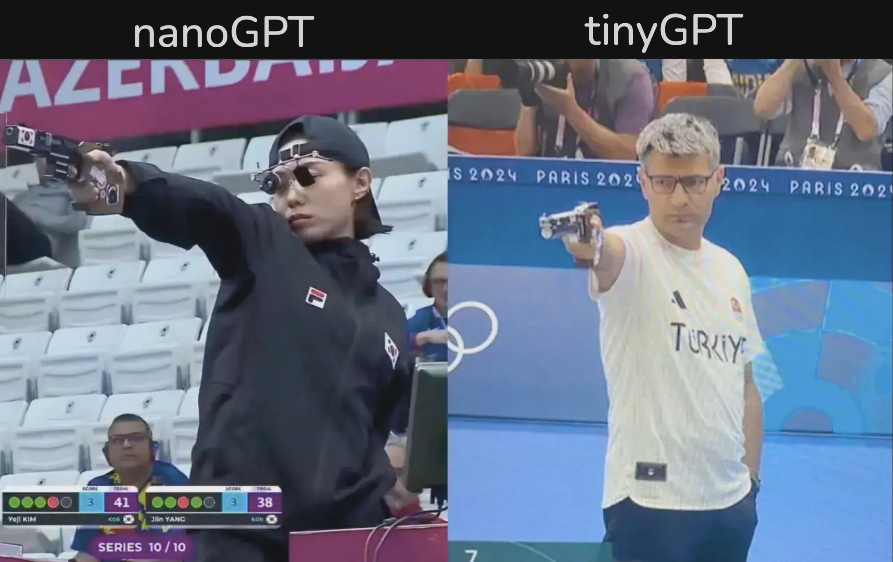

# tinyGPT

> [nanoGPT](https://github.com/karpathy/nanoGPT), but even [tinier](https://github.com/tinygrad/tinygrad)



---

# quick setup

Installation
```
git clone https://github.com/spikedoanz/tinyGPT
cd tinyGPT
uv venv .venv
uv pip install tinygrad numpy requests
```

Dataset prep
```
python data/shakespeare_char/prepare.py
```

Run
```
python train.py
```

# config

everthing is configured via environment variables. want DDP?

```
DDP=1 python train.py
```

different batch size?

```
BS=32 python train.py
```

and every other variable, just check out train.py!

---

# todo

- fineweb

# crackpot

- moe for ffn
- NoPE
- muon
- norm analysis
- moe for mha
